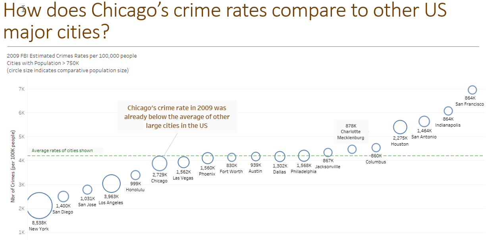
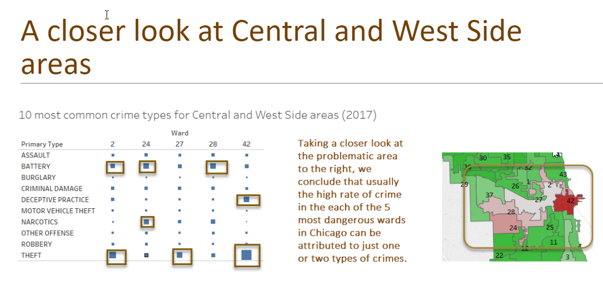
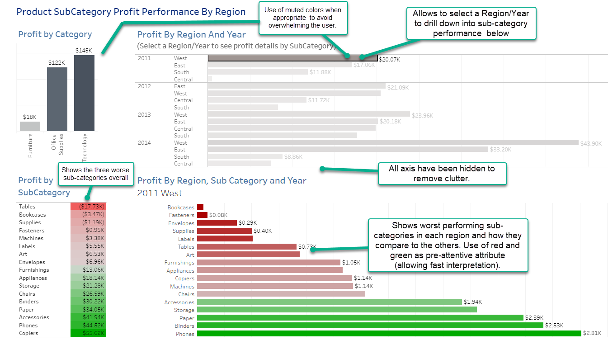
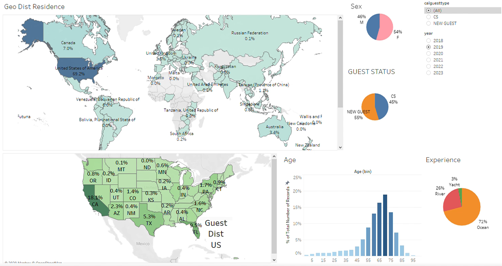

<b>Data Analytics Portfolio Repository</b>

 Hello,  
this repository is meant to showcase some of the Data Analytics personal projects that I have undertaken in the last few years.  

It is still a work in progress. Ultimately my goals is to add several examples of Tableau and Python work in the areas of data exploration and cleaning, predictive analytics, data visualization, as well as cool, engaging story telling from the insights gathered in the process of analysing some public datasets.
  

Current Repository Contents (2/10/22):
   <li> Analysis of Chicago's crime rate trends and implications for Real Estate development: data preparation done in Knime and visualizatios in Tableau (see <a href="https://docs.google.com/presentation/d/1WZDgabfWSKs8JU47x6Jur5nELj4j6Z9Q/edit?usp=sharing&ouid=111269397538579219547&rtpof=true&sd=true">full PowerPoint presentation</a>).
  

  <table cellpadding=5 cellspacing=5 border=0 marginleft="30px">
      <tr><td> </img></td> 
          <td> </img>  </td>  
      </tr></table> 
  
  </li>
  <li> Simple Tableau SuperStore analysis of <a href="https://public.tableau.com/app/profile/monica.rossetti/viz/ProfitAnalysisbyRegionYear/Dashboard1?publish=yes">Profit by Categories and Regions</a>  to illustrate some best principles of visualizations design. It showcases static and interactive panels, allowing the user to both have a highlight view of profit, as well drilling down further if desired. I also applied several design recommendations such as minimize clutter, use of pre-attemptive features (color and bar lenghts), and being mindfull of cognitive load (effort required to interpret the data) by not including information that is not necessary or exagerating the use of bright colors. 

     </img>

  </li>
  <li>Screenshot of guests analysis dashboard for Crystal Cruises: this was an interactive Tableau dashboard I developed that allowed executive users to explore the distribution of several guests dimensions (new X repeat guests, age, sex, preferred experience) by country of residence and sailing year. Data has been obcuscated for public display purposes. This visualization provided crucial insight into which markets/channels needed to have marketing and sales interventions to raise the proportion of new guests in future sales/years.

   </img>

  </li>
   <li> Examples of using Tableau for data exploration and detection of outliers: 
      <a href="https://public.tableau.com/app/profile/monica.rossetti/viz/DetectingOutliers_16454693254450/StripPlot?publish=yes">Strip Plot</a>  
      <a href="https://public.tableau.com/app/profile/monica.rossetti/viz/DetectingOutliers_16454693254450/HistogramofProfit?publish=yes">Histogram Of Profits</a> 
      <A href="https://public.tableau.com/app/profile/monica.rossetti/viz/OutliersExploration-ControlChart/ControlChart?publish=yes">Control Chart</a>   
   </li>
   <li> World Energy Sources Analysis from 2000 thru 2016: data preparation in Python. Data visualizations and dashboard in Tableau coming soon.</li>
 

I hope you enjoy the content!  

Thank you for visiting,  
Monica Rossetti
